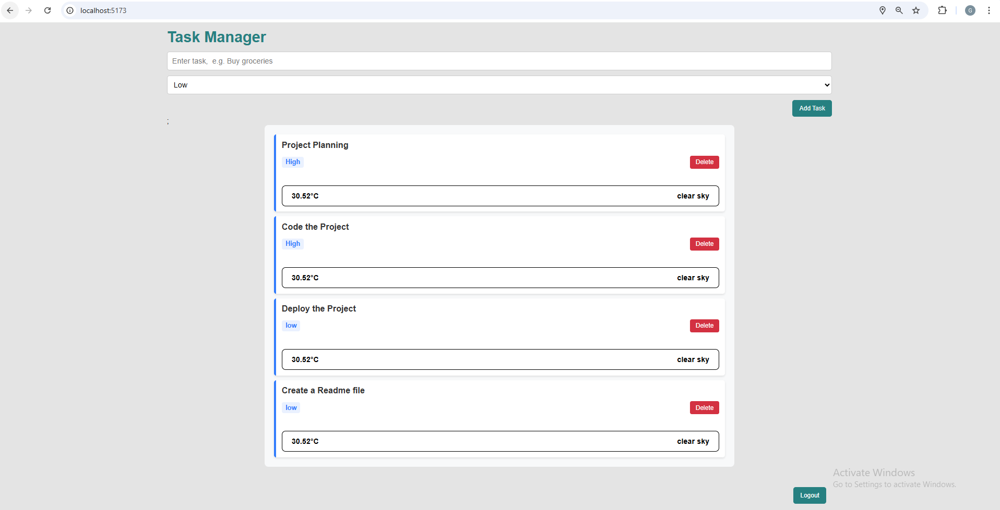

# About This Project

This is an **Advanced React To-Do Application** with **Weather API Integration**, built using React and CSS Modules.

## Features

- Users can create a new task by entering the task name in the input field and clicking the add button or pressing **Enter**.
- Users can set task priority as **Low, Medium, or High**.
- Users can delete a task by clicking the **Delete** button. After confirmation, the task will be deleted, or users can **cancel** accidental deletion.
- Users can see a **list of tasks** in the task list.
- Users can see **weather information** based on their current location.
- Only **logged-in users** can view the tasks.
- **Responsive design**, user-friendly interface, and modern UI.

# How to use the app:

- visit: https://task-manager-pro-gamma.vercel.app/
- Grant location permission on browser popup.
- Add a task and set priority.
- click on Login/Logout button at bottom right to simulate auth.

## Technologies Used

- **React + Vite**
- **Redux Toolkit**, Async Thunk
- **CSS Modules**
- **JavaScript (ES6+)**
- **HTML / CSS / JSX**
- **Local Storage** (for persistent data)
- **OpenWeather API** for weather information

# Setup steps

- git clone https://github.com/Gaganpreet-git/task-manager-pro.git
- npm install

# Add Environment Variables

- VITE_WEATHER_API_KEY= openweathermap.org
- VITE_WEATHER_API_URL=https://api.openweathermap.org/data/2.5/weather

# Run the Project

- npm run dev
- visit: (http://localhost:5173/)
